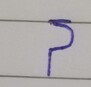
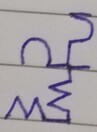
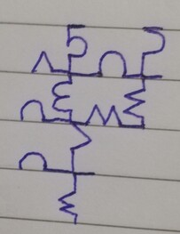
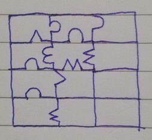

# Jigsaw - Overview
Jigsaw is a mono-syllabic writing system that resembles a jigsaw puzzle. 

*bad handwriting ahead; will replace with digital art later

# Letters

There are two groups of letter in Jigsaw: vertical letters (the consonants), and the horizontal letters (the vowels).

## Design specification

Each curve of the letter must be at least half of the line height.

# Writing Rules

Writing direction is top-down, right-to-left. Each word occupies one column. There is no punctuation in this writing system.

# Writing Tutorial

I choose the Malay language because the language is almost mono-syllabic. Let's write the sentence "Mari belajar." meaning "Let's learn."

1. Identify the words. For "Mari belajar", there are two words. Therefore, there is going to be two column for this sentence.

2. For each word, identify the mono-syllables. For the word "Mari", the syllables are "ma" and "ri". For the word "belajar", the syllables are "be", "la", "ja", "r-".

3. Start at the right side of the page.

4. Place a leading stroke before writing the consonant "m".

  

5. Start writing down the consonant "m" from top to bottom.

  

6. Start writing down the vowel "a" from right to left, completing the syllable "ma".

  

7. Using the same technique (leading stroke -> consonant -> vowel), continue to write the syllable "ri" right below "ma".

  

  

8. Now the word "Mari" is completed, move to the left to start a new column. Place your leading stroke for the next syllable, "be".

  

9. Using the same technique (leading stroke -> consonant -> vowel), write the syllable "be".

  

10. Before writing your next leading stroke, place your pen at the end of the previous syllable, "ma". Continue placing your leading stroke there.

  

  

11. Using the same technique (leading stroke next to previous syllable -> consonant -> vowel), write the rest of the syllable of the word: "la", "ja", "r-".

  

12. Finally, you can clean up the whole jigsaw by connecting all the missing lines.

  

  

13. Optionally, you can extend the lines at the right side of the page.

  

